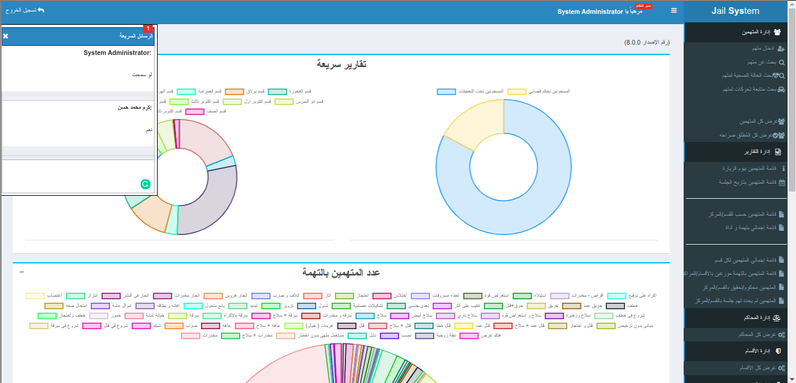
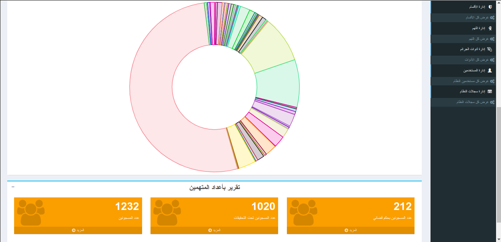

  
  

I was able to create this system but the main problem was with reports the customer needs and there is was change requests. such projects takes from me 1 monthe but it takes from me 2 monthes.

It was realy hard with change requests and new ideas customer needs always along with project development. I finished this project and I was so happy because I learned something new like dealing with sockets and complex database queries to create reports.
