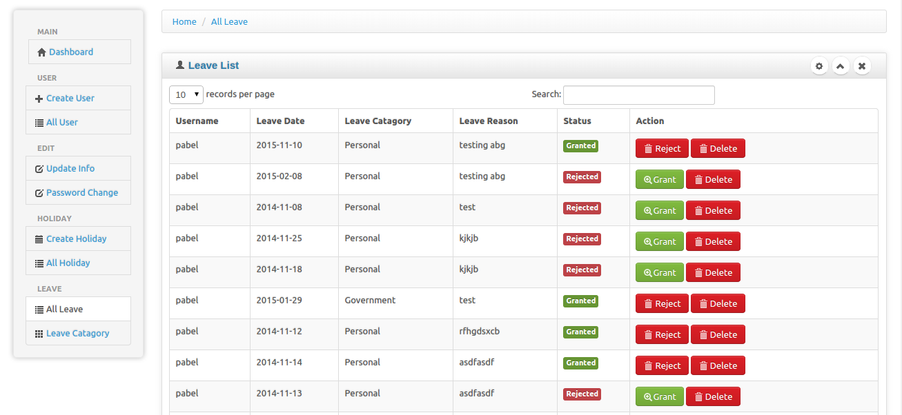

Attendance System is a web application that I created, Spring 2016. The project helped me to learn how to design and implement a responsive web site.

Attendance System  is implemented using [Codeigniter](https://codeigniter.com/), a PHP application framework. Within two monthes, I created a website that implements several types of reservations including technical reports, hr reports, and more.

In this project I gained experience with full-stack web application design and associated technologies, including [MYSQL](https://www.mysql.com/) for database storage, the [Twitter Bootstrap](http://getbootstrap.com/) CSS Framework for the user interface, and Javascript for both client and server-side programming.
 
 

Source: <a href="https://bitbucket.org/poode/tedata/src/master/"><i class="large bitbucket icon"></i>Attendance System</a>
